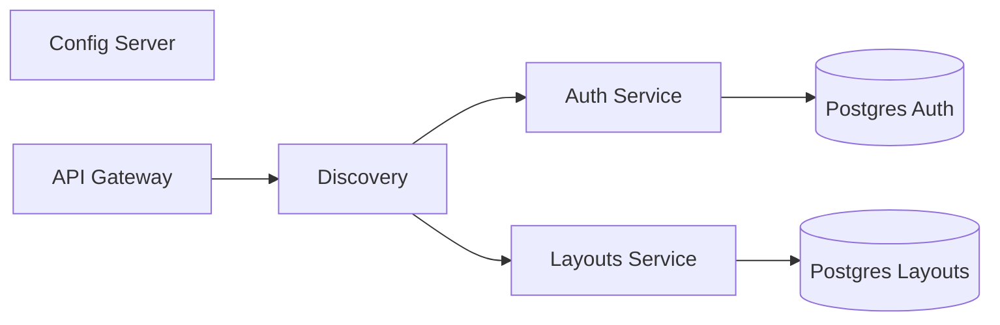

# Keyboard layout microservice app
This app war created as a solution for one of tasks by study. This is a simple app, that stores information about keyboard layouts. Only registered users can add values to storage.  

System built on [Spring Boot](https://spring.io/projects/spring-boot) framework, uses [Spring Cloud Gateway](https://spring.io/projects/spring-cloud-gateway) as API Gateway, [Eureka Service Discovery](https://spring.io/projects/spring-cloud-netflix) for service registration, separate [PostgreSQL](https://www.postgresql.org/) databases for each service, [Spring Cloud Config](https://spring.io/projects/spring-cloud-config) for centralized configuration management, and [Feign Client](https://spring.io/projects/spring-cloud-openfeign) for service-to-service communication. App is ready to deploy as [Kubernetes](https://kubernetes.io/) [Minikube](https://minikube.sigs.k8s.io/) application. Created [Postman collection](https://www.postman.com/) for testing.  

# Requirements
- Gradle 8
- Java 21
- PostgreSQL

# App scheme



# Ports of local apps in launch order
- config-server: 8888
- discovery: 8761
- auth-service: 9001
- layout-service: 9002
- api-gateway: 8080

How to test this repo: just load the collection to Postman and test it there. Here's the list of url's, defined in system. 

```txt
┬ localhost:8888 [config-server]
├─ GET /discovery/default
├─ GET /auth-service/default
├─ GET /layouts-service/default
└─ GET /api-gateway/default

┬ localhost:9001 [auth-service]
├─ POST /api/auth/login
└─ GET /api/auth/whoami

┬ localhost:9002 [layout-service]
├─ POST /layouts
└─ GET /layouts

┬ localhost:8080 [api-gateway]
├─ POST /AUTH-SERVICE/api/auth/login
├─ GET /AUTH-SERVICE/api/auth/whoami
├─ POST /LAYOUTS-SERVICE/layouts
└─ GET /LAYOUTS-SERVICE/layouts
```

# How to run in Mikikiube
Execute all scripts from `scripts` folder. But ensure, that new pods, created via manifest applying is creating only when all other pods already running and ok. This is important because all pods depends on each other.  

```zsh
# Script execute order
./scripts/build-jar.sh
./scripts/build-containers.sh
./scripts/apply-manifests.sh  # Please, do it manually for manifests
./scripts/port-forward.sh
```
